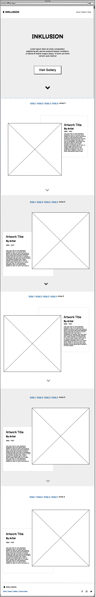
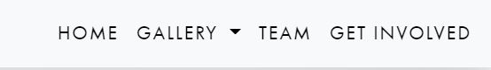
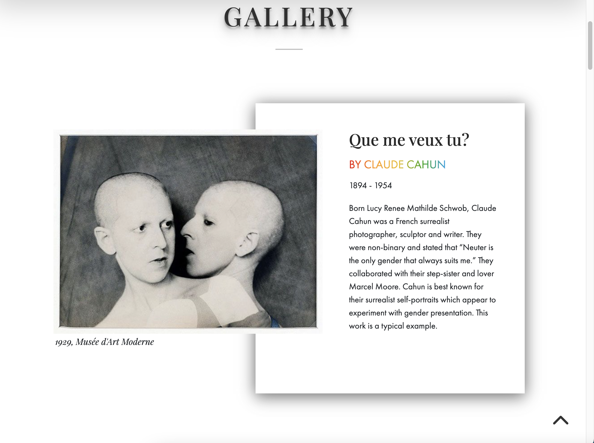
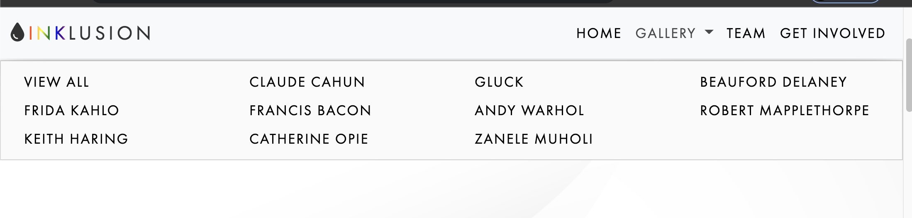
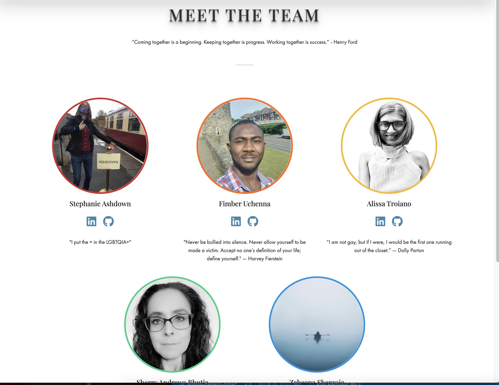

# **INKLUSION**

[Link to Live Project](link to live site goes here)

## Table of Contents
- [**INKLUSION**](#inklusion)
  - [Table of Contents](#table-of-contents)
  - [Introduction](#introduction)
  - [UX](#ux)
    - [User Stories](#user-stories)
    - [Wireframes](#wireframes)
  - [Features](#features)
    - [Existing Features](#existing-features)
      - [Navigation Bar](#navigation-bar)
      - [Website Theme Logo](#website-theme-logo)
      - [Jumbotron](#jumbotron)
      - [Gallery](#gallery)
      - [Gallery Dropdown](#gallery-dropdown)
      - [Team](#team)
    - [Features Left to Implement](#features-left-to-implement)
  - [Technologies Used](#technologies-used)
    - [Languages Used](#languages-used)
    - [Frameworks, Libraries & Programs Used](#frameworks-libraries--programs-used)
  - [Testing](#testing)
  - [Deployment](#deployment)
    - [GitHub Pages](#github-pages)
    - [Forking the GitHub Repository](#forking-the-github-repository)
    - [Cloning the GitHub Repository](#cloning-the-github-repository)
  - [Credits](#credits)
    - [Code](#code)
    - [Content](#content)
    - [Media](#media)
    - [Other](#other)

## Introduction

This is a website providing information about LGBTQIA+ art throughout history. In keeping with Pride 2022 Theme: Togetherness, this website provides information on famous LGBTQA+ artists along with photo representation of a quintessential art piece from their repertoire. The website also provides information on local LGBTQA+ artists and how they can be contacted. The site is targeted towards not just the LGBTQA+ community, but to those interested in expanding their knowledge of art and looking to support local LGBTQA+ artists by adding to their art collection. 
[The live project can be found here.](https://alissatroiano.github.io/team-6/)
## UX

### User Stories

| ID | As a... | I Want To Be Able To... | So That I Can...|
| --- | --- | --- | --- |
| 01 | User | Some capability e.g. navigate site | Some benefit |
| 02 | User | Some capability | Some benefit |
| 03 | User | Some capability | Some benefit |

### Wireframes

The following wireframes were created to help plan the layout of the site:

* 
* [Homepage](docs/wireframes/wireframe.pdf)

## Features

### Existing Features

#### Navigation Bar

* Located concisely at the top right of every page 
* The user can easily navigate to different sections of the site with ease. 

#### Website Theme Logo

* Logo is located at the top left of the home page for easy access.
* Clicking on the logo will bring the user back to the home page. 

#### Jumbotron

#### Gallery

#### Gallery Dropdown

#### Team

### Features Left to Implement

* A constantly updating showcase of current and up-and-coming LGBTQIA+ artists.
* A directory of LGBTQIA+ creatives with the option to contact them and buy art work.
* A forum for LGBTQIA+ art lovers to meet and discuss art.

## Technologies Used

### Languages Used
* [HTML5](https://en.wikipedia.org/wiki/HTML5)
* [CSS3](https://en.wikipedia.org/wiki/CSS)
* [JavaScript] (https://en.wikipedia.org/wiki/JavaScript)

### Frameworks, Libraries & Programs Used
* [AOS Library](https://michalsnik.github.io/aos/)
* [Bootstrap 5](https://getbootstrap.com/)
* [Font Awesome](https://fontawesome.com/)
* [Google Fonts](https://fonts.google.com/)
* [Adobe Fonts](https://www.adobe.com/products/typekit.html)

## Testing

Details about the testing we have carried out.

## Deployment

### GitHub Pages

The project was deployed to GitHub Pages. The following steps are used to deploy the site:
* Navigate to GitHub and locate and select the GitHub repository.
* Navigate to the settings tab and select the 'Pages' tab from the menu.
* Under 'Source' click the dropdown labelled 'None' and select the 'master' branch.
* Click save. The page will automatically refresh and the published site link can be found on the 'Pages' tab.
* The link can be found here - link to live site

### Forking the GitHub Repository

The following steps can be used to fork the GitHub repository:
* On GitHub navigate to the main page of the repository.
* The 'Fork' button can be found on the top righthand side of the screen.
* Click the button to create a copy of the original repository.

### Cloning the GitHub Repository

The following steps can be used to clone the GitHub repository:
* On GitHub navigate to the main page of the repository.
* Above the list of files select 'Code'.
* Three options are provided, HTTPS, SSH and GitHub CLI. Select the appropriate option and click the 'Copy' button next to the URL.
* Open Git Bash.
* Change the working directory to the location for the cloned directory.
* Type git clone and paste the copied URL.
* Press 'Enter' to create the clone.

## Credits

* Information about the artists has been taken from [Wikipedia](https://en.wikipedia.org/wiki/Main_Page).
Add the below to the media credits section:
* Claud Cahun's Que me veut tu? is owned by the [Musee d'Art Modern](https://www.mam.paris.fr/en).
* Gluck's Medallion is found in a Private Collection (photo by Christie's Images).
* Beauford Delaney's Can Fire in the Park is owned by the [Smithsonian American Art Museum](https://americanart.si.edu/).
* Frida Kahlo's Las dos Fridas is owned by the [Museo de Arte Moderno](https://mam.inba.gob.mx/).
* Copyright for Francis Bacon's portrait of George Dyer in a Mirror is owned by the Estate of Francis Bacon.
* Copyright for Andy Warhol's Brillo Box is owned by the Andy Warhol Foundation for the Visual Arts.
* Robert Mapplethorpe's Self Portrait is owned by the [Solomon R. Guggenheim Museum](https://www.guggenheim.org/).
* Keith Haring's Ignorance = Fear / Silence = Death is owned by the [Whitney Museum of American Art](https://whitney.org/).
* Copyright for Catherine Opie's Chicken is owned by Catherine Opie.
* Copyright for Zanele Muholi's ID Crisis is owned by Zanele Muholi.

### Code

  * [Electrillo](https://alissatroiano.github.io/team-4-april-2022/team.html) team page was used to help with the styling of the team page.
  * [Smitten](https://alissatroiano.github.io/8-your-heart-out/developer-page.html) team page was used to help with the styling of the team page.
  * This [Codepen](https://codepen.io/bartveneman/pen/PQMzxp) was used to create the layout for the gallery pieces.
  * [Mozilla]https://developer.mozilla.org/en-US/docs/Web/CSS/grid-template-rows) was used to create the layout for the gallery pieces.

### Content

* Information about the artists has been taken from [Wikipedia](https://en.wikipedia.org/wiki/Main_Page).

### Media
* Claud Cahun's Que me veut tu? is owned by the [Musee d'Art Modern](https://www.mam.paris.fr/en).
* Gluck's Medallion is found in a Private Collection (photo by Christie's Images).
* Beauford Delaney's Can Fire in the Park is owned by the [Smithsonian American Art Museum](https://americanart.si.edu/).
* Frida Kahlo's Las dos Fridas is owned by the [Museo de Arte Moderno](https://mam.inba.gob.mx/).
* Copyright for Francis Bacon's portrait of George Dyer in a Mirror is owned by the Estate of Francis Bacon.
* Copyright for Andy Warhol's Brillo Box is owned by the Andy Warhol Foundation for the Visual Arts.
* Robert Mapplethorpe's Self Portrait is owned by the [Solomon R. Guggenheim Museum](https://www.guggenheim.org/).
* Keith Haring's Ignorance = Fear / Silence = Death is owned by the [Whitney Museum of American Art](https://whitney.org/).
* Copyright for Catherine Opie's Chicken is owned by Catherine Opie.
* Copyright for Zanele Muholi's ID Crisis is owned by Zanele Muholi.
* The jumbotron image was licensed from [Adobe Stock](https://stock.adobe.com/163166422)

### Other

* Any other credits